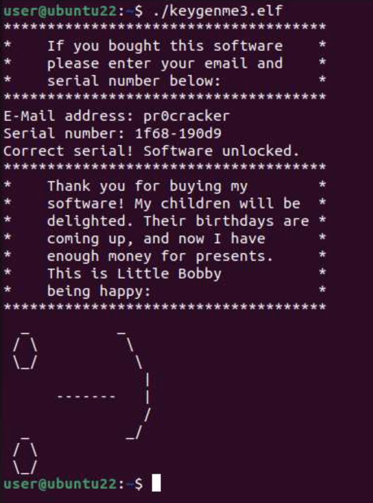
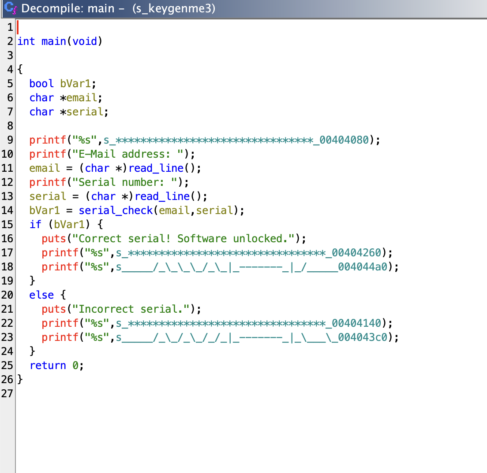
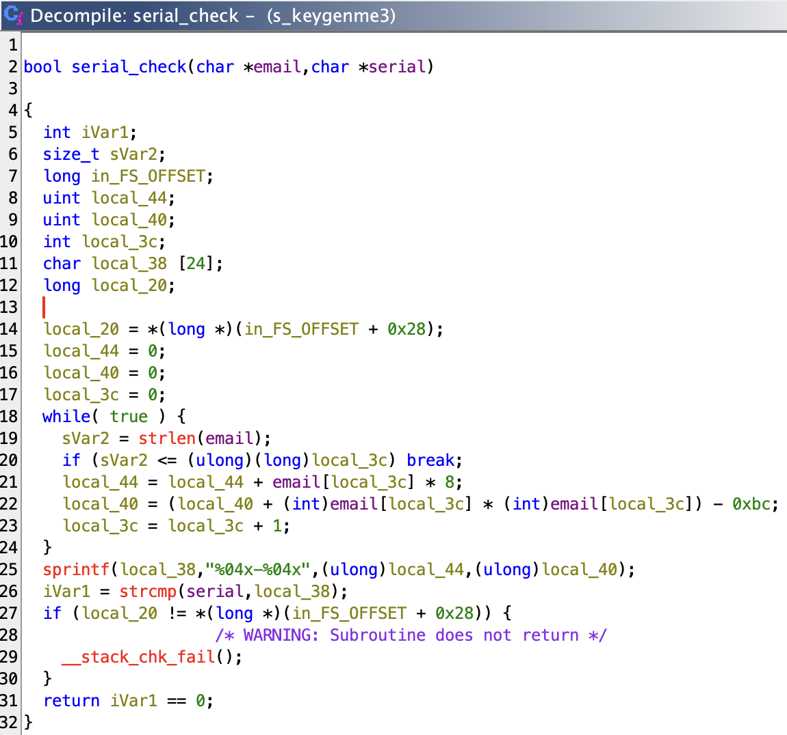

# KeygenMe3 Reverse Engineering

This project documents the process of reverse engineering a stripped 64-bit ELF binary that implements a serial number validation system. Using Ghidra for static analysis, I extracted the validation algorithm and developed a working keygen that generates valid serial numbers for any email address.



## Overview

The keygenme3 binary is a challenge program that validates user-provided email and serial number pairs. This writeup covers the complete reverse engineering process, from initial binary analysis to implementing a functional keygen in C.

## Repository Structure

```
keygen-reverse-engineering/
├── binary/
│   └── keygenme3          # Original challenge binary (stripped ELF)
├── src/
│   ├── cracker.c          # Keygen implementation
│   ├── main.c             # Reimplementation of keygenme3
│   └── varify.c           # Serial verification tool
├── images/                # Ghidra analysis screenshots
├── ANALYSIS.md
├── BUILD.md
├── QUICKSTART.md
└── GHIDRA_NOTES.md
```

## Quick Start

### Build the Keygen

```bash
make cracker
```

### Generate a Serial

```bash
./bin/cracker pr0cracker
```

Output: `1f68-190d9`

### Test with Original Binary

```bash
./binary/keygenme3
```

```
********************************
E-Mail address: pr0cracker
Serial number: 1f68-190d9
Correct serial! Software unlocked.
********************************
```

## Reverse Engineering Process

### 1. Binary Analysis

The first step was to identify what kind of binary we're dealing with:

```bash
$ file binary/keygenme3
keygenme3: ELF 64-bit LSB executable, x86-64, version 1 (SYSV),
dynamically linked, interpreter /lib64/ld-linux-x86-64.so.2,
for GNU/Linux 3.2.0, stripped
```

Key observations:
- 64-bit ELF executable for Linux
- x86-64 architecture
- Stripped (no debugging symbols or function names)
- Dynamically linked

### 2. Ghidra Decompilation

I loaded the binary into Ghidra for static analysis. Since it was stripped, all functions had generic names like `FUN_00101234`.



After letting Ghidra analyze the binary, I identified the entry point and started renaming functions based on their behavior:
- Entry point → `main`
- Validation logic → `serial_check`

### 3. Serial Validation Algorithm

The critical function was `serial_check`, which validates user input:



The decompiled function shows the algorithm clearly. Looking at the code, I can see that it:
1. Iterates through each character in the email
2. Accumulates two values using simple arithmetic operations
3. Formats them as hexadecimal and compares with the provided serial

### 4. Algorithm Extraction

Breaking down the algorithm from the decompiled code:

**Algorithm**:

```
Initialize:
  part1 = 0
  part2 = 0

For each character in email:
  part1 += character * 8
  part2 += (character * character) - 0xbc    // 0xbc = 188 decimal

serial = sprintf("%04x-%04x", part1, part2)
```

Example calculation for `"pr0cracker"`:

| Character | ASCII | part1 increment | part2 increment |
|-----------|-------|-----------------|-----------------|
| p         | 112   | 112 × 8 = 896   | 112² - 188 = 12356 |
| r         | 114   | 114 × 8 = 912   | 114² - 188 = 12808 |
| 0         | 48    | 48 × 8 = 384    | 48² - 188 = 2116   |
| ...       | ...   | ...             | ...             |

Final values:
- part1 = 8040 = `0x1f68`
- part2 = 102617 = `0x190d9`
- Serial: `1f68-190d9`

### 5. Keygen Implementation

With the algorithm understood, implementing the keygen was straightforward. Here's [cracker.c](src/cracker.c):

```c
#include <stdio.h>
#include <string.h>

int main(int argc, char *argv[]) {
    if (argc != 2) {
        printf("Usage: %s <email>\n", argv[0]);
        return 1;
    }
    
    char *email = argv[1];
    unsigned int part1 = 0;
    unsigned int part2 = 0;
    
    for (int i = 0; i < strlen(email); i++) {
        part1 += email[i] * 8;
        part2 += (email[i] * email[i]) - 0xbc;
    }
    
    printf("%04x-%04x\n", part1, part2);
    return 0;
}
```

The keygen accepts an email as a command-line argument and outputs the corresponding serial number.

### 6. Verification

Testing against the original binary confirmed the keygen works correctly:


```bash
$ ./bin/cracker pr0cracker
1f68-190d9

$ ./binary/keygenme3
********************************
E-Mail address: pr0cracker
Serial number: 1f68-190d9
Correct serial! Software unlocked.
********************************
```

✅ **Verification successful!** The keygen produces valid serials.

## 🛠️ Building from Source
The keygen successfully generates valid serials for any email address.

## Tools Used

- **Ghidra** - Static binary analysis and decompilation
- **GCC** - Compiler for building the keygen

## Additional Documentation

- [ANALYSIS.md](ANALYSIS.md) - Detailed technical analysis
- [BUILD.md](BUILD.md) - Build instructions
- [QUICKSTART.md](QUICKSTART.md) - Quick reference guide

## Notes

Variable names like `local_44` and `local_40` in the Ghidra output are auto-generated based on stack offsets. The algorithm itself is simple but demonstrates common keygen validation patterns found in software protection schemes.

## License

This project is for educational purposes only.
